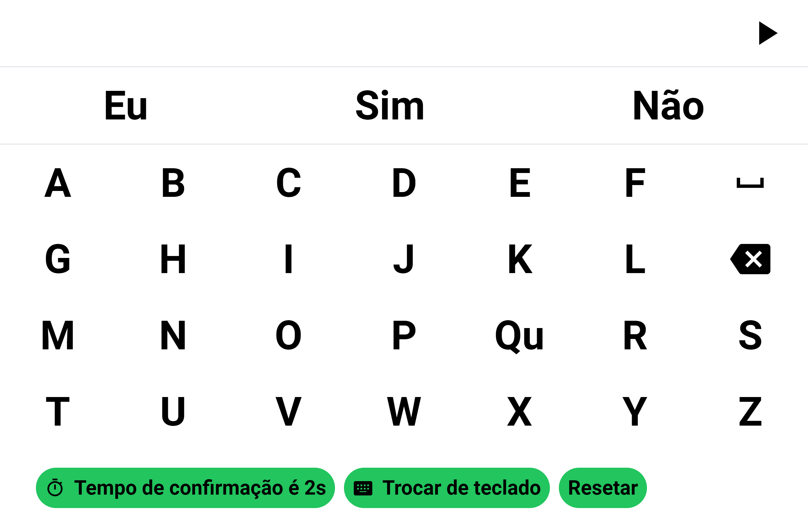

<h1 align="center" style="color: #22C55E; font-size: 3.5rem">
  Communication 

  

 

## 🚀 Tecnologias

Tecnologias utilizadas no projeto:

- ReactJS
- Typescript
- Tailwindcss

 

## 💻 Projeto

Communication é um aplicativo desenvolvido para facilitar a comunicação de pessoas com Parkinson, utilizando óculos especiais que atuam como um controle de cursor. A aplicação permite que o usuário escreva no teclado apenas passando o cursor sobre as teclas, sem a necessidade de pressioná-las. Após a conclusão da mensagem, o sistema transforma o texto em fala. O processo é controlado por meio de botões de play e pause: o usuário inicia a construção da mensagem ao dar play e, ao final, pode pausar para que o texto seja lido em voz alta, garantindo maior autonomia na comunicação.

 

## ⚒️ Features

- [x] Controle do cursor através de óculos especiais
- [x] Teclado virtual com interação por hover
- [x] Sistema de transformação de texto em fala
- [x] Botões de controle: **Play** para iniciar e **Pause** para encerrar a leitura
- [x] Interface acessível e intuitiva para facilitar o uso

- [x] Versão web
- [x] Versão mobile

 

## 🌐 Deploy

Você pode ver o site clicando <a href="https://communication.gabriel-sousa.dev/" target="_blank">nesse link</a>.

 

## :memo: Licença

Esse projeto está sob a licença MIT. Veja o arquivo <a href="https://github.com/Gabriel-Sousa/communication/blob/master/.github/LICENSE" target="_blank">LICENSE</a>  para mais detalhes.

---

Feito com ♥ por Gabriel Sousa
